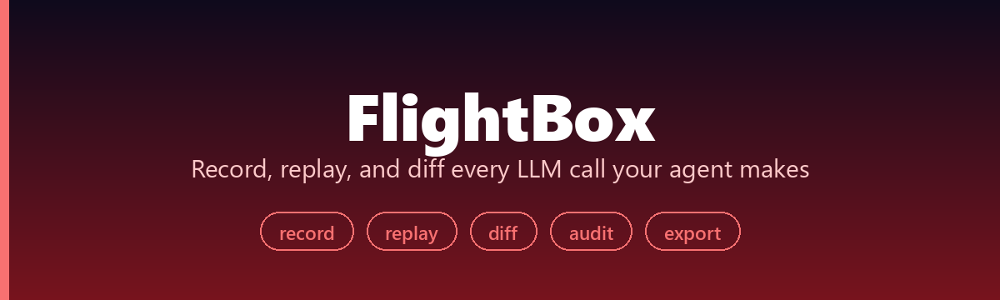
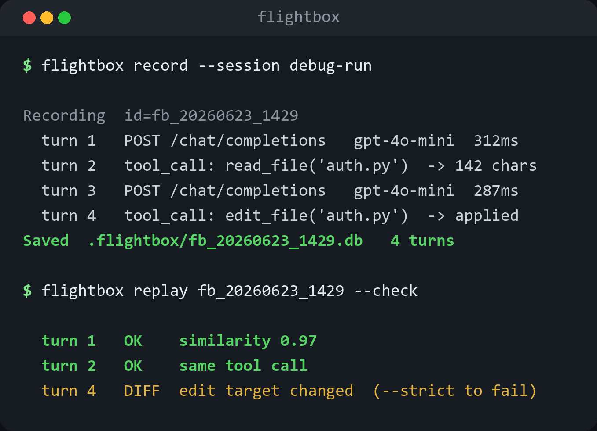

<div align="center">



[](https://pypi.org/project/flightbox/)
[](https://pypi.org/project/flightbox/)
[](LICENSE)

[**Quick Start**](#quick-start) · [**Record**](#record) · [**Replay**](#replay) · [**Diff**](#diff) · [中文](README_CN.md)

</div>

<p align="center"></p>

**Black-box flight recorder for AI agents** — record every LLM call your agent makes, replay sessions deterministically, and export a redacted evidence report when something breaks.

FlightBox is local-first. Recordings live in SQLite. No hosted dashboard is required.

## Why

An agent failed and nobody can reproduce it. The final answer is in a log, but the interesting evidence is scattered across LLM requests, tool calls, model responses, timing, tokens, and local notes.

FlightBox gives you a deterministic debugging trail:

- record OpenAI / Anthropic / LiteLLM calls
- replay the same responses later
- diff two runs
- export JSONL or pytest replay tests
- generate a redacted Markdown / HTML report for PRs, CI notes, and teammates

## Quick Start

```bash
pip install flightbox
```

### Record

```python
import flightbox
from openai import OpenAI

client = OpenAI()

with flightbox.record("debug-session") as rec:
    response = client.chat.completions.create(
        model="gpt-4o",
        messages=[{"role": "user", "content": "What is 2+2?"}],
    )
    print(response.choices[0].message.content)

print(f"Recorded as run: {rec.run_id}")
```

### Replay

```python
import flightbox

with flightbox.replay("abc123def4"):
    response = client.chat.completions.create(
        model="gpt-4o",
        messages=[{"role": "user", "content": "What is 2+2?"}],
    )
    print(response.choices[0].message.content)
```

### Inspect

```bash
flightbox list
flightbox show <run-id>
flightbox stats <run-id>
flightbox timeline <run-id>
flightbox diff <run-a> <run-b>
flightbox diff <run-a> <run-b> --ignore-field request
```

### Export

```bash
# JSONL eval rows
flightbox export <run-id> -f jsonl -o eval_dataset.jsonl

# Raw payloads are opt-in; the default JSONL export redacts common secrets.
flightbox export <run-id> -f jsonl --raw -o private_fixture.jsonl

# pytest replay skeleton
flightbox export <run-id> -f pytest -o test_replay.py

# redacted evidence report
flightbox report <run-id> -f md -o evidence.md
flightbox report <run-id> -f html -o evidence.html
flightbox report <run-id> \
  --note "reproduced after retry-path patch" \
  --verify "pytest tests/test_agent.py -q" \
  --env repo=agent-demo \
  -o evidence.md

# compact redacted call timeline
flightbox timeline <run-id> -o timeline.md

# audit raw recordings before sharing evidence
flightbox audit <run-id>
flightbox audit <run-id> -f json -o audit.json
flightbox audit <run-id> --policy .flightboxignore
```

The report redacts common API keys, bearer tokens, GitHub tokens, and authorization headers before writing the file. It also records lightweight evidence metadata: notes, verification commands, Python version, platform, and optional `KEY=VALUE` environment facts.
The timeline is a shorter PR-friendly view: one row per recorded call, with provider, model, latency, token totals, error state, and redacted request / response previews.
The audit command scans the raw recording for common secret patterns and reports only the event, top-level field, JSON path, pattern, and redacted preview. For noisy but safe fields, add a `.flightboxignore` policy:

```text
# Ignore a whole top-level recording field.
field:token_usage

# Ignore one JSON path. `*` matches list entries.
path:request.messages.*.content

# Disable a pattern by name.
pattern:github-token
```

## LiteLLM

```bash
pip install "flightbox[litellm]"
```

```python
import flightbox
import litellm

with flightbox.record("router-debug") as rec:
    litellm.completion(
        model="openrouter/openai/gpt-4o-mini",
        messages=[{"role": "user", "content": "ping"}],
    )

with flightbox.replay(rec.run_id):
    litellm.completion(
        model="openrouter/openai/gpt-4o-mini",
        messages=[{"role": "user", "content": "ping"}],
    )
```

## CLI Reference

```bash
flightbox list                    # List recorded runs
flightbox show <run-id>           # Show run details and events
flightbox stats <run-id>          # Summarize latency, tokens, and errors
flightbox timeline <run-id>       # Render a compact redacted call timeline
flightbox audit <run-id>          # Check raw payloads for common secret patterns
flightbox audit <run-id> --policy .flightboxignore
flightbox diff <run-a> <run-b>    # Compare two runs
flightbox diff <run-a> <run-b> --ignore-field request  # Hide expected volatile fields
flightbox export <run-id>         # Export as redacted JSONL or pytest
flightbox export <run-id> --raw   # Keep raw JSONL payloads for private fixtures
flightbox report <run-id>         # Export a redacted evidence report
flightbox report <run-id> --note "..." --verify "pytest -q" --env os=windows
flightbox delete <run-id>         # Delete a recording
```

## Supported SDKs

- OpenAI Python SDK (`openai>=1.0`) — sync and async
- Anthropic Python SDK (`anthropic>=0.20`)
- LiteLLM (`litellm>=1.0`) — `completion` and `acompletion`
- SDKs and frameworks that call through those clients

## Storage

Recordings are stored in `.flightbox/recordings.db` by default. You can pass a custom database path with `--db` in the CLI or by constructing `RecordStore` yourself.

## Roadmap

Record / replay / diff / report are solid. The next steps are about covering more of what agents actually call and turning recordings into a real regression gate:

- **Wider SDK coverage** — Google GenAI, Cohere, and raw HTTP LLM clients, so a recording doesn't depend on which SDK an agent happens to use.
- **A baseline assertion for CI** — `flightbox assert <run> --against baseline.jsonl` that fails the build when an agent's call sequence drifts from a recorded baseline, so behavior change is caught in review, not in production.
- **Cost and latency trends** — roll the per-call token/latency data already captured into a small cross-run summary, so a regression in spend is as visible as one in output.
- **A local transcript viewer** — a single-file HTML view of a run's call chain, for when a Markdown timeline isn't enough to see where two runs diverged.

It stays local-first throughout — no recording ever has to leave your machine.

## Related projects

- [AgentProbe](https://github.com/he-yufeng/AgentProbe) — a pytest plugin for regression-testing AI agents
- [agentcikit](https://github.com/he-yufeng/agentcikit) — CLI tools for AI-agent, MCP, and CI evidence and safety
- [CoreCoder](https://github.com/he-yufeng/CoreCoder) — a minimal AI coding agent you can read end to end

## License

MIT
